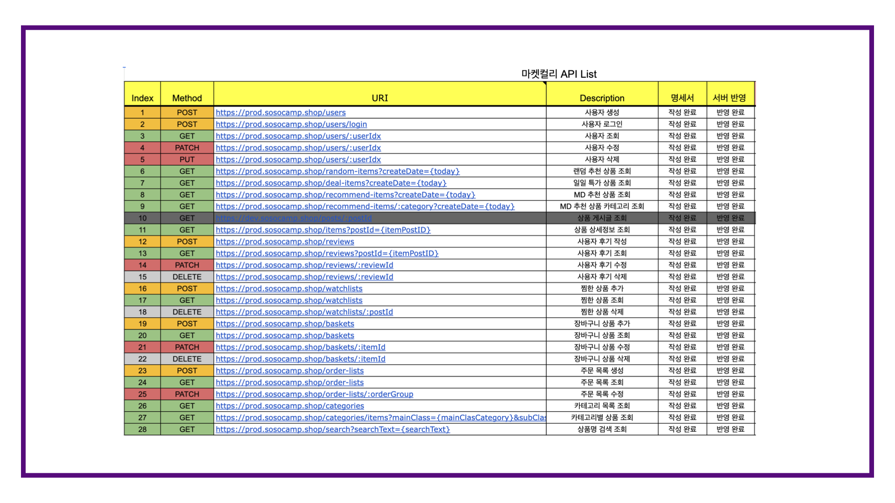

 

# 마켓컬리 클론코딩

## 1. 개요
- 목적 : 클론코딩을 통한 Node.js API 서버 구축
- 주요 개발 기능 : 회원 가입/로그인, 상품 검색, 주문하기
- 기간 : 2022.03 ~ 2022.04 (2주)
- 인원 : 서버(본인), iOS(익명 2명)

 

## 2. 서버 아키텍쳐

 

## 3. 개발 범위

- 회원가입/로그인

- 홈 화면

- 상품 설명

- 상품 후기

- 찜한 상품

- 장바구니

- 주문하기

- 카테고리/검색

 

## 4. ERD
- 개념데이터 모델링

- ERD 설계 (일부)

## 5. API
- REST API 설계
- API 명세서 : https://docs.google.com/spreadsheets/d/1HR8Xi4R32Tbei08mWs7xnuQsKoPU-W1hn3QS-3wyHOo/edit?usp=sharing

